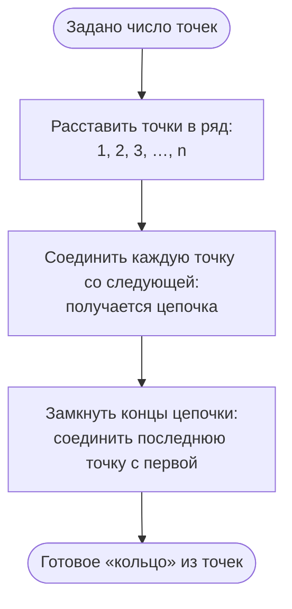

# Алгоритм генерации цепного (кольцевого) графа (Chain)

Генератор строит граф‑**кольцо**: вершины образуют простую цепь, концы которой
дополнительно замкнуты ребром. Несмотря на название `Chain`, реализация добавляет
ребро между последней и первой вершинами, поэтому результат — цикл `C_n`.

## Параметры

- `verticesCount` — количество вершин в графе (≥ 0).

## Валидация параметров

1. Если `verticesCount < 0` — ошибка «Количество вершин в графе не может быть
   отрицательным».

## Шаги

1. Создать пустой граф на `verticesCount` вершинах. Вершины с индексами
   `1..verticesCount` уже созданы внутри графа.
2. Для каждого `i` от `1` до `verticesCount - 1` (включительно) добавить ребро
   между вершинами `i` и `i + 1`. Так получается цепь
   `1 — 2 — 3 — ... — verticesCount`.
3. Дополнительно добавить ребро между вершинами `verticesCount` и `1`, замыкая
   цепь в цикл.
4. Вернуть граф.

## Ключевые свойства

- Каждая вершина имеет степень 2 (для `verticesCount ≥ 3`).
- Граф связен и является простым циклом `C_n`.
- При `verticesCount = 0` или `verticesCount = 1` цикл вырожден; реализация
  всё равно вызывает `AddEdge` для замыкания, но `Graph.AddEdge` игнорирует
  рёбра с несуществующими вершинами, так что некорректных состояний не
  возникает.

## Блок-схема

