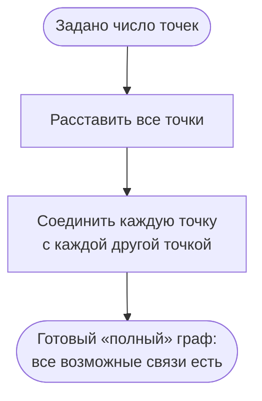

# Алгоритм генерации полного графа / клики (Clique)

Генератор строит **полный граф** `K_n` — граф, в котором каждая пара различных
вершин соединена ребром.

## Параметры

- `verticesCount` — количество вершин (≥ 0).

## Валидация параметров

1. Если `verticesCount < 0` — ошибка «Количество вершин в графе не может быть
   отрицательным».

## Шаги

1. Создать пустой граф на `verticesCount` вершинах. Вершины `1..verticesCount`
   создаются автоматически.
2. Перебрать все неупорядоченные пары `(i, j)` такие, что `1 ≤ i < j ≤ verticesCount`:
   - Для каждой пары добавить ребро `(i, j)` в граф.
3. Вернуть граф.

## Ключевые свойства

- Получается полный неориентированный граф `K_n`.
- Количество рёбер — `n × (n - 1) / 2`.
- Степень каждой вершины — `n - 1`.

## Блок-схема

