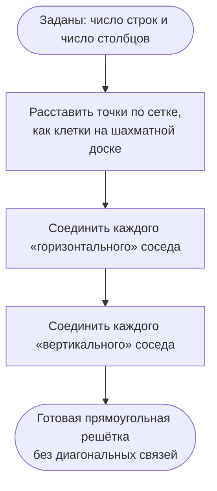

# Алгоритм генерации регулярной решётки (RegularGrid)

Генератор строит **прямоугольную решётку** `rowsCount × colsCount`: вершины
расставлены в узлах сетки, и каждая вершина соединена со своими ближайшими
соседями по горизонтали и по вертикали (без диагоналей).

## Параметры

- `rowsCount` — количество строк, > 0.
- `colsCount` — количество столбцов, > 0.

## Валидация параметров

1. Если `rowsCount <= 0` — ошибка «Количество строк в решётке должно быть
   положительным».
2. Если `colsCount <= 0` — ошибка «Количество столбцов в решётке должно быть
   положительным».

## Нумерация вершин

Каждой клетке решётки соответствует одна вершина. Индекс вершины в клетке
`(rowIndex, colIndex)` (нумерация с нуля) считается по формуле:

```
id(rowIndex, colIndex) = rowIndex * colsCount + colIndex + 1
```

Сдвиг `+ 1` нужен, потому что индексы вершин в проекте начинаются с 1.
Таким образом, всего вершин — `rowsCount × colsCount`.

## Шаги

1. Создать пустой граф на `rowsCount × colsCount` вершинах.
2. Добавить **горизонтальные** рёбра: для каждой строки `rowIndex` от 0 до
   `rowsCount - 1` и каждого `colIndex` от 0 до `colsCount - 2` добавить ребро
   `(id(rowIndex, colIndex), id(rowIndex, colIndex + 1))`.
3. Добавить **вертикальные** рёбра: для каждой строки `rowIndex` от 0 до
   `rowsCount - 2` и каждого `colIndex` от 0 до `colsCount - 1` добавить ребро
   `(id(rowIndex, colIndex), id(rowIndex + 1, colIndex))`.
4. Вернуть граф.

## Ключевые свойства

- Граф планарный, регулярный по структуре (не путать с регулярным по степени —
  угловые вершины имеют степень 2, краевые — 3, внутренние — 4).
- Количество рёбер: `rowsCount × (colsCount - 1) + (rowsCount - 1) × colsCount`.
- Граф не содержит диагональных рёбер и циклов короче 4.

## Блок-схема


